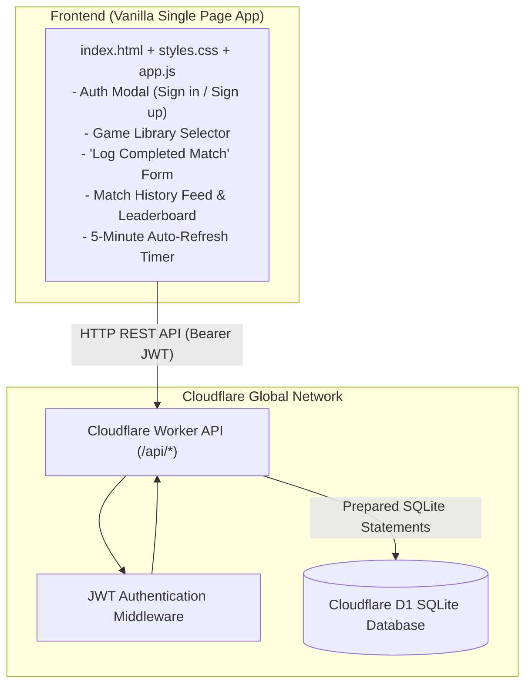

# Multi-Game Score Tracker & Match Records (Cloudflare Workers + D1 + Vanilla Frontend)

A complete architecture and design specification for building a post-game match logger, score records manager, and player stats tracker.

---

## 1. Confirmed Architecture & Requirements

| Component | Choice / Specification |
|---|---|
| **App Type** | **Multi-Game Tracker & Post-Game Match Logger** (log finished games, record final scores, track winners and player stats) |
| **Frontend** | **Plain Vanilla HTML5 + Modern CSS + Vanilla JavaScript** (zero build step, lightning-fast edge static delivery) |
| **Backend** | **Cloudflare Workers** (TypeScript / Hono router with edge performance) |
| **Database** | **Cloudflare D1** (Serverless SQLite at the edge) |
| **Data Sync** | **5-Minute Polling Timer** (client auto-refreshes data every 5 minutes + instant manual refresh button) |
| **Authentication** | **User Accounts** (Email/Password registration & login, secure PBKDF2/WebCrypto hashing, JWT sessions) |

---

## 2. System Architecture Diagram



---

## 3. ASCII UI Mockups

### Screen 1: Main Dashboard & Match History

```text
+----------------------------------------------------------------------------------------------------+
|  [#] GAME SCORE HUB          [All Games v]   [+ Log Game Result]   [+ New Game Type]    (User: Alex)  |
|  * Updated just now - Next auto-refresh in 04:32  [Refresh Now]                           [Logout]  |
+----------------------------------------------------------------------------------------------------+
|                                                                                                    |
|  LEADERBOARD: Catan                                                                                |
|  +----------------------+--------------------+-------------------+--------------------+----------+ |
|  | Player               | Matches Played     | Wins              | Win Rate           | Avg Score| |
|  +----------------------+--------------------+-------------------+--------------------+----------+ |
|  | [1] Sarah (Winner)   | 14                 | 8                 | 57.1%              | 9.8      | |
|  | [2] Alex             | 14                 | 4                 | 28.5%              | 8.4      | |
|  | [3] John             | 10                 | 2                 | 20.0%              | 7.1      | |
|  +----------------------+--------------------+-------------------+--------------------+----------+ |
|                                                                                                    |
|  RECENT MATCH RECORDS                                                                              |
|  +-----------------------------------------------------------------------------------------------+ |
|  | Catan - Friday Board Game Night                           Played: Oct 24, 2026 at 21:30        |
|  | Notes: 4-player base game with longest road contest                                           |
|  |                                                                                               |
|  |   [#1 WINNER]  Sarah    -- 10 pts  (Longest Road)                                              |
|  |   [#2]         Alex     --  9 pts                                                              |
|  |   [#3]         John     --  7 pts                                                              |
|  |   [#4]         David    --  6 pts                                                              |
|  |                                                                        [View Details] [Delete] |
|  +-----------------------------------------------------------------------------------------------+ |
|  | Mario Kart 8 Deluxe - Weekend Cup                          Played: Oct 22, 2026 at 18:15        |
|  |   [#1 WINNER]  Alex     -- 54 pts                                                              |
|  |   [#2]         Sarah    -- 48 pts                                                              |
|  |   [#3]         Leo      -- 35 pts                                                              |
|  |                                                                        [View Details] [Delete] |
|  +-----------------------------------------------------------------------------------------------+ |
+----------------------------------------------------------------------------------------------------+
```

---

### Screen 2: "Log Completed Match" Modal (After-Game-End Record)

```text
+-------------------------------------------------------------------------------+
|                         LOG COMPLETED MATCH RECORD                       [X]  |
+-------------------------------------------------------------------------------+
|                                                                               |
|  Select Game:                                                                 |
|  [ Catan                                                v ]  [+ New Game]     |
|                                                                               |
|  Match Title / Session:                Date & Time Played:                    |
|  [ Friday Game Night                 ] [ 2026-10-24 21:00                   ] |
|                                                                               |
|  Notes (Optional):                                                            |
|  [ 4-player match, Sarah took longest road in final turn                    ] |
|                                                                               |
|  ---------------------------------------------------------------------------  |
|  PLAYERS & FINAL SCORES:                                                      |
|                                                                               |
|    #   Player Name             Final Score      Winner?                       |
|   ---+-----------------------+----------------+--------------------------     |
|    1 | [ Sarah             ] | [ 10         ] | [*] Winner (Auto / Manual)    |
|    2 | [ Alex              ] | [ 9          ] | [ ]                           |
|    3 | [ John              ] | [ 7          ] | [ ]                           |
|    4 | [ David             ] | [ 6          ] | [ ]  [Remove]                 |
|                                                                               |
|   [+ Add Another Player]                                                      |
|  ---------------------------------------------------------------------------  |
|                                                                               |
|                                         [Cancel]      [ Save Match Record ]   |
+-------------------------------------------------------------------------------+
```

---

## 4. Database Schema Design (Cloudflare D1 SQLite)

Tailored specifically for post-game records and aggregate analytics:

```sql
-- 1. Users Table
CREATE TABLE IF NOT EXISTS users (
    id TEXT PRIMARY KEY,
    email TEXT UNIQUE NOT NULL,
    password_hash TEXT NOT NULL,
    username TEXT NOT NULL,
    created_at DATETIME DEFAULT CURRENT_TIMESTAMP
);

-- 2. Games Catalog (e.g., Catan, Chess, Mario Kart, Scrabble)
CREATE TABLE IF NOT EXISTS games (
    id TEXT PRIMARY KEY,
    user_id TEXT NOT NULL REFERENCES users(id) ON DELETE CASCADE,
    name TEXT NOT NULL,
    scoring_type TEXT DEFAULT 'highest_wins', -- 'highest_wins' (points) or 'lowest_wins' (golf, racing rank)
    created_at DATETIME DEFAULT CURRENT_TIMESTAMP
);

-- 3. Completed Matches
CREATE TABLE IF NOT EXISTS matches (
    id TEXT PRIMARY KEY,
    game_id TEXT NOT NULL REFERENCES games(id) ON DELETE CASCADE,
    user_id TEXT NOT NULL REFERENCES users(id) ON DELETE CASCADE,
    title TEXT NULL,                      -- e.g. "Friday Board Game Night"
    notes TEXT NULL,                      -- e.g. "Longest road tiebreaker"
    played_at DATETIME NOT NULL,          -- When the match was played
    created_at DATETIME DEFAULT CURRENT_TIMESTAMP
);

-- 4. Match Player Results (Final Scores & Rank per player)
CREATE TABLE IF NOT EXISTS match_players (
    id TEXT PRIMARY KEY,
    match_id TEXT NOT NULL REFERENCES matches(id) ON DELETE CASCADE,
    player_name TEXT NOT NULL,
    score REAL NOT NULL,                  -- Supports integers or decimal scores
    rank INTEGER NOT NULL,                -- 1 = 1st place, 2 = 2nd place, etc.
    is_winner BOOLEAN DEFAULT 0,          -- 1 if won, 0 otherwise
    notes TEXT NULL                       -- Optional player-specific note (e.g. "Played Blue")
);

-- Indexes for lightning fast queries and leaderboards
CREATE INDEX IF NOT EXISTS idx_matches_game_id ON matches(game_id);
CREATE INDEX IF NOT EXISTS idx_matches_user_id ON matches(user_id);
CREATE INDEX IF NOT EXISTS idx_match_players_match_id ON match_players(match_id);
CREATE INDEX IF NOT EXISTS idx_match_players_player_name ON match_players(player_name);
```

---

## 5. REST API Specifications

All private endpoints require `Authorization: Bearer <JWT_TOKEN>`.

### Authentication
- `POST /api/auth/register` — Body: `{ email, username, password }`
- `POST /api/auth/login` — Body: `{ email, password }` -> Returns `{ token, user }`
- `GET /api/auth/me` — Returns current logged-in user profile

### Game Management
- `GET /api/games` — Fetch user's registered games
- `POST /api/games` — Body: `{ name, scoring_type }`
- `DELETE /api/games/:id` — Delete a game and its associated matches

### Match Records (After-Game-End Recording)
- `GET /api/matches?game_id=:id` — Fetch matches (filtered by game or all recent matches) with embedded player scores & winners
- `POST /api/matches` — **Save a completed match**:
  ```json
  {
    "game_id": "game_123",
    "title": "Friday Board Game Night",
    "played_at": "2026-10-24T21:00:00Z",
    "notes": "4-player base game",
    "players": [
      { "player_name": "Sarah", "score": 10, "notes": "Longest road" },
      { "player_name": "Alex", "score": 9 },
      { "player_name": "John", "score": 7 }
    ]
  }
  ```
  *(Backend automatically ranks players and flags `is_winner` based on game's `scoring_type`)*
- `GET /api/matches/:id` — Get single match details
- `DELETE /api/matches/:id` — Delete a match record

### Analytics & Leaderboards
- `GET /api/stats?game_id=:id` — Returns aggregated stats per player (matches played, wins, win rate %, average score, best score).

---

## 6. Frontend UI Structure (Vanilla HTML / CSS / JS)

### File Layout
```text
game-manage/
├── wrangler.toml              # Cloudflare configuration with D1 binding
├── package.json               # Backend dependencies (hono, wrangler)
├── tsconfig.json
├── migrations/
│   └── 0001_init.sql          # D1 initial schema
├── src/
│   ├── index.ts               # Worker API entry point (Hono)
│   ├── auth.ts                # Edge PBKDF2 hashing & JWT tokens
│   └── routes/
│       ├── auth.ts            # Auth endpoints
│       ├── games.ts           # Game catalog endpoints
│       └── matches.ts         # Match record & stats endpoints
└── public/                    # Plain Vanilla Frontend
    ├── index.html             # UI Structure & Modals
    ├── styles.css             # Modern clean styling (responsive dark/light theme)
    └── app.js                 # App state, API client, Modal controller, 5-min timer
```

### Key Frontend Components:
1. **Header & Timer Bar**:
   - Logo, game filter dropdown, "+ Log Game Result" button, user profile/logout.
   - **5-Minute Auto-Refresh Counter**: Live countdown timer that refreshes the match list and leaderboard every 5 minutes with a manual **[Refresh Now]** button.
2. **Leaderboard / Player Summary**:
   - Instant overview of who wins the most in the selected game, win rates, and average scores.
3. **Match Records Feed**:
   - Chronological feed of completed matches with podium rankings, scores, and dates.
4. **"Log Completed Match" Modal**:
   - Simple, fast form to record results after finishing a game.
   - Allows dynamically adding/removing players.
   - Auto-sorts and determines the winner based on high/low scoring rule.

---

## 7. Next Steps for Implementation

1. **Phase 1**: Initialize project dependencies and create `wrangler.toml` with D1 configuration.
2. **Phase 2**: Create the SQLite migration script `migrations/0001_init.sql` and run local D1 migrations.
3. **Phase 3**: Implement the Cloudflare Worker backend using Hono (Auth, Games, Matches, Stats).
4. **Phase 4**: Build the Vanilla HTML/CSS/JS frontend in `public/`.
5. **Phase 5**: Run and verify locally via `npx wrangler dev`.
